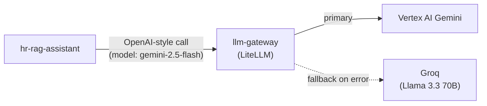
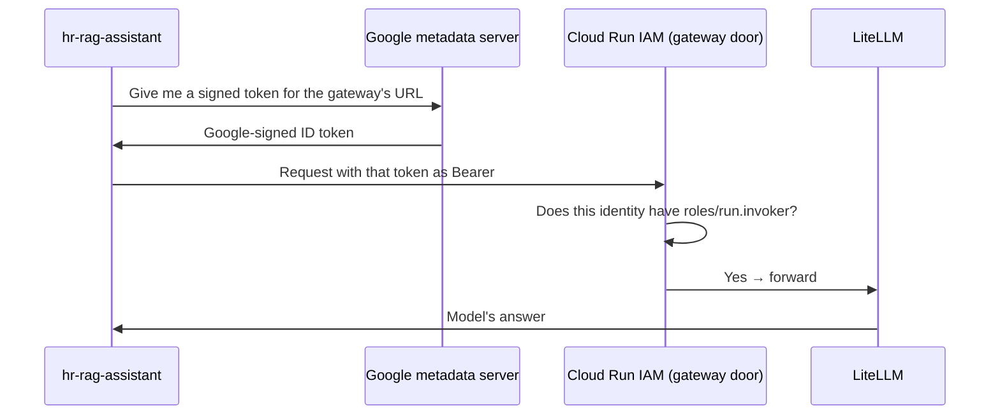

# 14. LLM Gateway

## Why put anything in front of the model

Without a gateway, the app calls Vertex AI Gemini directly from
`hr_assistant/llm.py`. That works, but:

- there's no single place to see every model call,
- there's no place to add a fallback model without changing app code,
- more apps later would each need their own Vertex AI credentials.

With the gateway, the app makes one kind of call and the gateway decides
what actually serves it (see "Primary + fallback" below).

The **LLM gateway** (`llm-gateway`, a separate Cloud Run service running
**LiteLLM**, an open-source proxy) sits between the app and Gemini so every
call goes through one governed point.

`llm.py` has two modes: call Vertex AI directly (default, for local dev),
or route through the gateway when `LLM_GATEWAY_URL` is set (deployed).

## Primary + fallback model

`gateway/litellm-config.yaml` maps the app's `gemini-2.5-flash` call to two
backends:

- **primary** — `vertex_ai/gemini-2.5-flash`
- **fallback** — `groq/llama-3.3-70b-versatile`, used only if the Vertex
  call errors (quota, region outage, 5xx), after `num_retries`

The app doesn't know or care which one answered — it always asks for
`gemini-2.5-flash`. The fallback needs `GROQ_API_KEY` in the gateway's
environment (set at deploy time — see commands.md, Phase 12).

## A real authentication bug

**First attempt:** deploy the gateway privately and have the app send a
shared secret key as `Authorization: Bearer <key>`. It broke — for an
instructive reason.

Cloud Run's own IAM layer *also* reads the `Authorization: Bearer` header
on every request to a private service, and expects a **Google-signed
identity token** there, not an arbitrary key. Cloud Run's front door
rejected every request with a platform-level `401` before LiteLLM ever saw
it. (Confirmed: only Cloud Run's access log showed the request, LiteLLM's
own log showed nothing.)

**Rejected option:** make the gateway public like the main app. No — the
gateway has **no guardrails of its own** and talks straight to billable
Gemini. A leaked key here is a real cost/abuse risk.

**The fix:** stop sending a shared secret. Use Cloud Run's IAM check the
way it's meant to work.

The app mints that token itself with
`google.oauth2.id_token.fetch_id_token()` — works automatically on Cloud
Run, no credential file. The gateway has **no access secret at all** —
who may call it is purely `roles/run.invoker`, granted only to the app's
service account. (`GROQ_API_KEY` is on the gateway too, but that's a
downstream key for the fallback model, not a gate on the gateway itself.)

**The ~1-hour token expiry:** Google ID tokens live ~1 hour. Rather than
mint one at build time and freeze it, `hr_assistant/llm.py` caches the
token with a shorter (~50 min) TTL and re-mints it on demand from an httpx
request hook, so **every** call to the gateway carries a current token —
even in a session left open for hours. Minting is a fast, internally-cached
metadata-server call, so doing it per request costs effectively nothing.

Next: **[doc 15 — Content Guardrails](15-content-guardrails.md)**.
