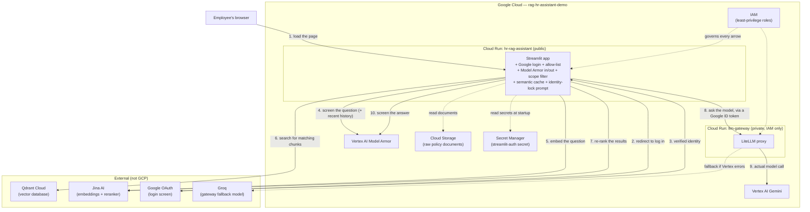

# 16. Full Hosting Architecture

Every piece from docs 01–15 in one picture. Project
`rag-hr-assistant-demo`, region `us-central1`.

*Steps 4 and 10 (Model Armor) run before the semantic-cache lookup and
after generation respectively. On step 4 a flagged question stops here; a
cache hit after step 4 skips straight to the answer, past steps 5–9.*

## Reading the diagram

- **Solid arrows** — the live path for one question, in order.
- **Dashed arrows** — background/startup access.
- **`hr-rag-assistant`** is the only service a human talks to. Public at
  the network level, gated by Google login + the allow-list before
  anything works.
- **`llm-gateway`** is never reached by a human — private Cloud Run, only
  the app's identity can call it, proven with a Google-signed token on
  every request.
- **IAM** isn't a step — it's the permission checks running under every
  arrow.
- **Qdrant and Jina are outside GCP** — a deliberate multi-vendor stack.

## The two services

| | `hr-rag-assistant` | `llm-gateway` |
|---|---|---|
| Who can reach it | Anyone (network) — gated by app login | Only the app's service account |
| Ingress setting | `--allow-unauthenticated` | `--no-allow-unauthenticated` |
| What enforces access | Google OAuth + `ALLOWED_EMPLOYEE_EMAILS` | Cloud Run IAM + `roles/run.invoker` |
| Its own guardrails | Model Armor in/out, scope filter, identity lock, semantic cache | None — a thin relay by design |
| Talks to Gemini | Through the gateway | Directly, as its own identity |

## Where each secret lives

| Secret | Lives in |
|---|---|
| OAuth client ID / secret / cookie key | Secret Manager, `streamlit-auth` |
| Qdrant + Jina API keys | Cloud Run env vars on `hr-rag-assistant` |
| Gateway auth | Nothing stored — a short-lived Google ID token, minted fresh |

That's the whole system. See **[commands.md](../commands.md)** to build it,
and **[summary.md](../summary.md)** for the current status and known
limitations.
